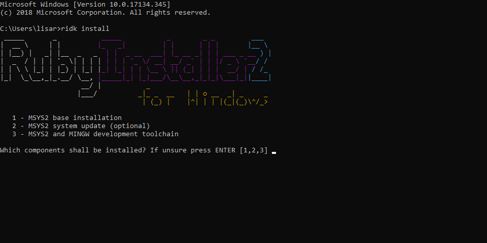
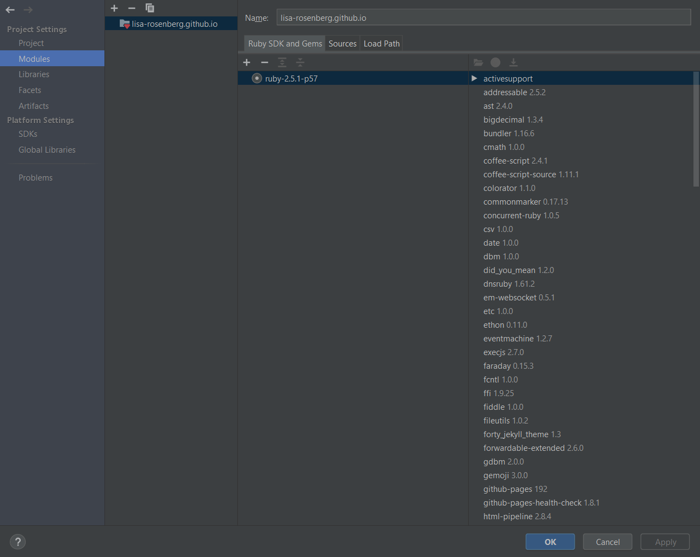
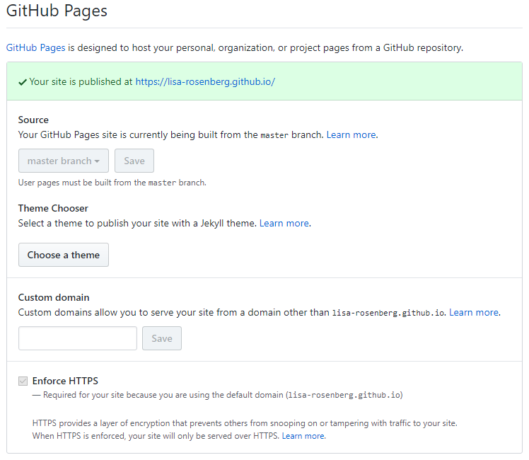
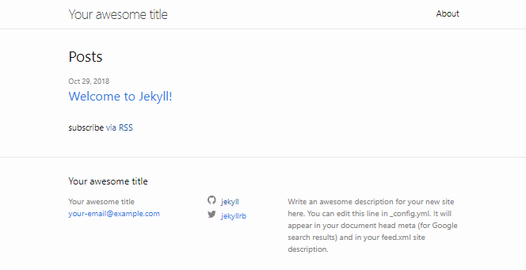

Setting up your own blog is a very easy task to do, especially nowadays.
With the help of Jekyll, Ruby and GitHub Pages it really is just a matter of some couple of minutes.
Plus it's totally free!
In this article I will show you step by step how I did set up my own personal blog.
Everything should be pretty straightforward and clear.
Nevertheless, please let me know if you run into problems of any kind.

## Tool Setup
### Source Code Editor or IDE
You may want to work with a source code editor or IDE with syntax highlighting and other helpful features.
I am using [IntelliJ Ultimate](https://www.jetbrains.com/idea/download/#section=windows) with the Ruby plugin, but [Visual Studio Code](https://code.visualstudio.com/Download) or something similar to this will do the job, too.
Try to choose an editor or IDE with an build-in terminal and syntax highlighting feature for Ruby, HTML, CSS, SCSS, YML and Markdown.
Although it's not a necessity, features like these will make it easier to work on your blog.

### Git and GitHub
If you want to host your blog via GitHub as a GitHub Page or on a custom domain, you will need to have an account on GitHub and Git installed on your working machine.
Join GitHub by following [this link](https://github.com/).
The latest version of Git is available [here](https://git-scm.com/downloads).

To check whether Git is properly installed, run the following command:
```shell
git --version
```

Some source code editors and IDE tools offer a Git integration.
This will make it a little bit easier to work on your blog articles, because you won't need to switch the working tool to commit your changes.
Personally I like to use one single tool which support everything I need to work properly.

### Ruby
In order to get your blog running locally, you'll need to install the programming language Ruby with Devkit included.
I downloaded the latest version for Windows from [here](https://rubyinstaller.org/downloads/).

After the basic installation of Ruby you will be prompted to install the optional Devkit.
You will need the Devkit in order to install Jekyll successfully.
Please choose the third installation option to run the full installation with MINGW development toolchain.



To check whether Ruby is properly installed, run the following commands:

```shell
ruby -v
gem -v
ridk version
```

If you are using an IDE that offers Ruby language integration you may want to add the Ruby SDK.
It's purely optional but will add some language related features like code completion, which always is a nice thing to have.
In IntelliJ Ultimate you need to download the Ruby plugin and add the installed Ruby SDK in the project settings.
You also need to replace your existing project module with a Ruby Gem module.
Your module settings of your project should look like this:



### Jekyll
Jekyll is a Ruby gem and comes along with a set of commands to easily build a static Jekyll website.
To install Jekyll, just run

```shell
gem install bundler jekyll
``` 

in the Command Prompt.
This will install Jekyll along with Bundler.
Bundler tracks and installs all of the Ruby gems and their versions you will use in your blog later.
It will also be used to build your Jekyll website locally.

To check whether Jekyll and Bundler are properly installed, run the following command:

```shell
jekyll -v
bundler -v
```

## Initialization
### Setting up a user repository
Firstly you need to create a new repository on GitHub.
The name for your repository has to follow a certain naming convention in order to make it a GitHub Pages repository: `<username>.github.io`.
GitHub will recognize this as your personal GitHub Page.
The enforced naming convention also leads to a single GitHub Pages domain per user.

A repository with this name is a so called user repository.
Other repositories are normal project repositories.
It's possible to use a project repository instead of a user repository for your Jekyll blog.
 In this article I will focus only on the latter, though.

There is one important restriction regarding user repositories.
In a user repository your GitHub Pages blog will only build from the master branch.
There is no way to change this behaviour in the repository settings:



Therefore, GitHub will automatically try to build anything you push on this branch.
Please keep this in mind.
Well, but what if you are working on larger articles or make greater changes to your blog?
Luckily it's possible to create other branches on user repositories for these purposes.
We will see how to even automate the whole process of releasing a new article to a productive environment.

Clone the repository you just have created via HTTPS or SSH.

### Creating a minimal Jekyll site
Now that we have all tools needed and a GitHub user repository to work with it's time to create your blog.

If not already done open your cloned local repository in your Source Code Editor or IDE with an build-in terminal.
Alternatively, navigate with the Command Line tool to it.
To create a new basic Jekyll site you have to run the following command:

```shell
jekyll new . --force
```

This command will use the current directory to create the new Jekyll site.
The `--force` parameter is necessary, because the directory is not empty anymore as already being a git repository.
If anything has worked you should read `New jekyll site installed in C:/path/to/repository.github.io.` as the last output.
Yes, this is basically anything you need to set up your first minimal blog!
The given command will set up some basic files and folders along with a minimal gem-based theme to start with.

To build your newly created Jekyll site locally you only have to run the following command:

```shell
bundle exec jekyll serve
```

If anything has successfully worked you should get the following output:

```shell
Configuration file: C:/path/to/repository.github.io/_config.yml
            Source: C:/path/to/repository.github.io
       Destination: C:/path/to/repository.github.io/_site
 Incremental build: disabled. Enable with --incremental
      Generating...
       Jekyll Feed: Generating feed for posts
                    done in 1.924 seconds.
 Auto-regeneration: enabled for 'C:/path/to/repository.github.io'
    Server address: http://127.0.0.1:4000/
  Server running... press ctrl-c to stop.
```

With this you now can access your freshly built Jekyll site with some example content by the given server address.
Now is a good time to commit and push your progress on GitHub.
GitHub will automatically build your Jekyll site which can be accessed online by using your GitHub GitHub Pages URL `https://<username>.github.io/`.
Locally and remotely your blog should now look like this:



### Basic structure of a Jekyll site
Okay, we now have a basic scaffold to work with.
Let's look on where to add actual content.
For this we need to understand the directory and file structure of Jekyll.
Your repository should now look like this:

```shell
.
├── _config.yml
├── _posts
|   └── 2018-10-29-welcome-to-jekyll.markdown
├── _site
├── .sass-cache
├── 404.html
├── about.md
├── Gemfile
├── Gemfile.lock
└── index.md
```

But for what are the files and directories used?
* **_config.yml**: Configuration data will be stored here
* **_posts**: This is the directory where blog posts should be stored
    * **YYYY-MM-DD-title-of-post.markdown**: Naming convention for any blog post markdown file
* **_site**: The built Jekyll site. Here is everything that is actually displayed in your browser
* **.sass-cache**: Stylesheet cache
* **404.html**: A basic error page
* **about.md**: Information about you
* **Gemfile**: Information about Ruby gems you want to use for your Jekyll site
* **Gemfile.lock**: Snapshot of the current Ruby gems and their versions in use
* **index.md**: Static content on your main page and layout information

In order to get started you probably want to modify the `_config.yml` file.
To add a new blog post just add a markdown file in the `_posts` directory according to the existing example markdown file.
Besides the content of your article you need to add some information on your blog post in the head part of the markdown file:

```
---
layout: post
title:  "Welcome to Jekyll!"
date:   2018-10-29 22:26:13 +0100
categories: jekyll update
---
```

That are the most important things you neeIf you aim to have a very basic blog, you can stop here.

## Hosting
    - Github Pages
    - Travis CI

    
## Everything else in jekyll doku